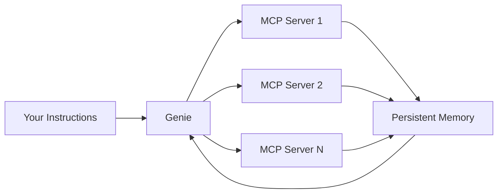
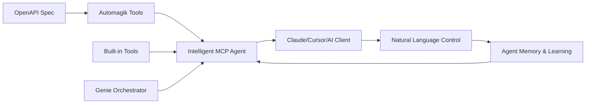

<div style={{ textAlign: 'center', marginBottom: '2rem' }}>
  <h1 style={{ fontSize: '2.5rem', fontWeight: '300', marginBottom: '1rem' }}>
    From <span style={{ fontWeight: '900', background: 'linear-gradient(to right, #FF00FF, #00FFFF)', WebkitBackgroundClip: 'text', WebkitTextFillColor: 'transparent' }}>API to AI</span> in 30 Seconds
  </h1>
  <p style={{ fontSize: '1.2rem', color: '#888', marginTop: '0' }}>
    The universal MCP generator that transforms any API into intelligent agents
  </p>
</div>

## What is Automagik Tools?

**Automagik Tools** is the **universal MCP (Model Context Protocol) generator** - transforming any API into an intelligent AI agent in seconds. Think of it as the bridge between your APIs and AI, enabling natural language control of any system without writing integration code.

Point to an OpenAPI spec, get an AI-ready agent. No code generation, no complex setup—just instant intelligence.

## The Problem

Connecting AI to real-world systems is broken:

- **Weeks of Development**: Creating MCP integrations takes 2-4 weeks per API
- **Zero Standardization**: Every team reinvents the wheel differently
- **Maintenance Nightmare**: APIs change, everything breaks
- **No Reusability**: Can't share integrations across projects
- **Complex Deployment**: Getting to production is a full-time job
- **Expertise Required**: Need deep technical knowledge to create MCPs

**The Real Cost**: Companies spend **R$ 45,000 and 3 weeks** per integration. For 10 APIs, that's **R$ 450,000** and nearly a year of developer time.

## The Solution

Automagik Tools **flips the script completely**:

<CardGroup cols={2}>
  <Card title="30-Second Generation" icon="bolt">
    Transform any OpenAPI spec into a fully functional MCP agent instantly. What took weeks now takes seconds.
  </Card>
  <Card title="Self-Learning Agents" icon="brain">
    Agents remember your patterns, adapt to your workflow, and improve with every interaction.
  </Card>
  <Card title="Universal Protocol" icon="globe">
    One standard (MCP) for all integrations. Works with Claude, Cursor, Cline, Roo Code, Gemini CLI.
  </Card>
  <Card title="Zero Installation" icon="rocket">
    Run with `uvx automagik-tools` - no global install, no configuration files, just instant execution.
  </Card>
</CardGroup>

## Key Features

### 🧞 Genie: Universal Orchestrator
The crown jewel - a meta-agent that coordinates unlimited MCP servers with persistent memory:



- **Connect Unlimited MCPs**: Coordinate any number of MCP servers
- **Persistent Memory**: Remembers context across all sessions
- **Natural Language**: Just describe what you want in plain English
- **Team Sharing**: Via SSE transport for distributed coordination

### 🔧 Instant MCP Generation
Transform any API into an intelligent agent:

- **OpenAPI → MCP**: Point to spec, get working agent in 30 seconds
- **Self-Optimizing**: Agents learn your usage patterns
- **Type Safety**: Fully typed tools with validation
- **Documentation**: Auto-generated from API specs

### 📦 Built-In Tools
Pre-integrated tools ready to use:

- **`genie`**: Universal MCP orchestrator with memory
- **`automagik`**: Automagik Suite integration (Spark, Hive, Forge, Omni)
- **`automagik-workflows`**: Claude Code workflow execution
- **`evolution-api`**: WhatsApp automation via Evolution API
- **`omni`**: Complete messaging platform integration
- **`openapi`**: Dynamic agent from any OpenAPI spec

### 🔄 Three Transport Modes
Deploy anywhere:

- **stdio**: Local development, perfect for Claude Desktop
- **SSE**: Team sharing, real-time coordination
- **HTTP**: API integration, cloud deployment

### 🎨 Three Intelligence Modes
- **Standard**: Precise, structured responses
- **Markdown**: GPT-4.1-nano cleans JSON into readable format
- **Genie**: Natural language orchestration with memory

## Who is Automagik Tools For?

<AccordionGroup>
  <Accordion title="AI Agent Developers">
    **Stop writing integrations from scratch**. Generate MCP tools in 30 seconds instead of 3 weeks.

    **Value**: 99% time reduction, instant API connectivity, focus on agent logic not plumbing.
  </Accordion>

  <Accordion title="Innovation Teams">
    **Test POCs rapidly**. Validate AI use cases in hours, not months.

    **Value**: Experiment with any API instantly, fail fast, iterate quickly.
  </Accordion>

  <Accordion title="Enterprises with APIs">
    **Make legacy systems AI-ready**. Turn internal APIs into conversational interfaces.

    **Value**: Your APIs become intelligent agents instantly, no migration needed.
  </Accordion>

  <Accordion title="Platform Engineers">
    **Centralize tool infrastructure**. One hub for all organizational tools.

    **Value**: Standardization, version control, reusability across teams.
  </Accordion>
</AccordionGroup>

## Real-World Magic

### Stripe Payments in 30 Seconds
```bash
uvx automagik-tools openapi https://raw.githubusercontent.com/stripe/openapi/master/openapi/spec3.json

# Now just talk to it:
# "Process a $100 payment for customer cus_123"
# "Show me failed payments from last week"
# "Create a subscription for Pro plan"
```

### Discord Bot Without Code
```bash
uvx automagik-tools openapi \
  https://raw.githubusercontent.com/discord/discord-api-spec/main/specs/openapi.json \
  -t sse --port 8001

# Natural language commands:
# "Schedule a voice call for 3pm in the dev channel"
# "Find all threads mentioning the new feature"
```

### Your Internal API, AI-Ready
```bash
# Your company's API becomes conversational
uvx automagik-tools openapi https://api.yourcompany.com/openapi.json

# Team shares the same learning agent via SSE
# Agent adapts to company terminology and workflows
```

## Architecture



## The Evolution of Integration

**Traditional Development**: 3 weeks × R$ 15k = **R$ 45,000 per integration**

**With Automagik Tools**: 30 seconds × R$ 200 = **R$ 100 per integration**

**Savings**: **R$ 44,900 per integration** (99% cost reduction)

For 10 integrations/year:
- Traditional cost: **R$ 450,000**
- Automagik Tools: **R$ 1,000** + R$ 24k/year Enterprise
- **ROI: 1,770%**

## Universal Compatibility

Works with **any MCP-compatible client**:

<CardGroup cols={3}>
  <Card title="Claude Code" icon="code">
    Native integration with stdio transport
  </Card>
  <Card title="Cursor" icon="arrow-pointer">
    Built-in MCP support
  </Card>
  <Card title="VSCode + Cline" icon="brackets-curly">
    Full MCP compatibility
  </Card>
  <Card title="Roo Code" icon="r">
    Direct MCP integration
  </Card>
  <Card title="Gemini CLI" icon="gem">
    Works seamlessly
  </Card>
  <Card title="Any MCP Client" icon="plug">
    Universal protocol
  </Card>
</CardGroup>

## Philosophy

Automagik Tools embodies our core philosophy:

<Card title="AI that elevates human potential, not replaces it" icon="users">
  - **You orchestrate** - Agents execute
  - **You describe** - Agents implement
  - **You decide** - Agents suggest
  - **You own** - No vendor lock-in
  - **You control** - Open source, self-hostable
</Card>

## Why "Automagik Tools"?

Just like magic seems impossible until you understand how it works, **Automagik Tools makes the complex simple**. Transforming weeks of integration work into 30 seconds feels like magic—but it's just **excellent engineering**.

The "Tools" part? Every great builder needs the right tools. We're building tools that give AI agents the power to interact with any system, anywhere.

---

## Next Steps

<CardGroup cols={2}>
  <Card title="Installation" icon="download" href="/tools/installation">
    Get Automagik Tools installed in 2 minutes
  </Card>
  <Card title="Quick Start" icon="rocket" href="/tools/quickstart">
    Your first AI agent in 5 minutes
  </Card>
  <Card title="GitHub Repository" icon="github" href="https://github.com/namastexlabs/automagik-tools">
    Star us on GitHub
  </Card>
  <Card title="PyPI Package" icon="python" href="https://pypi.org/project/automagik-tools">
    Install via PyPI
  </Card>
  <Card title="Discord Community" icon="discord" href="https://discord.gg/xcW8c7fF3R">
    Join the community
  </Card>
  <Card title="Built-In Tools" icon="wrench" href="/tools/built-in-tools">
    Explore pre-built integrations
  </Card>
</CardGroup>
