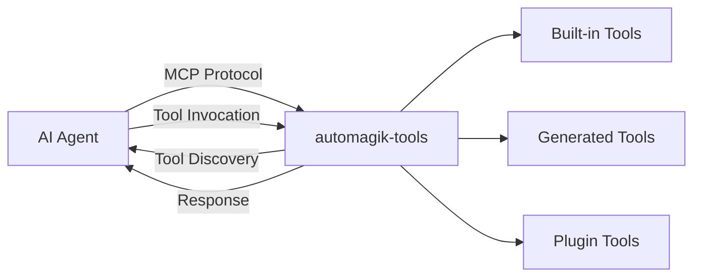
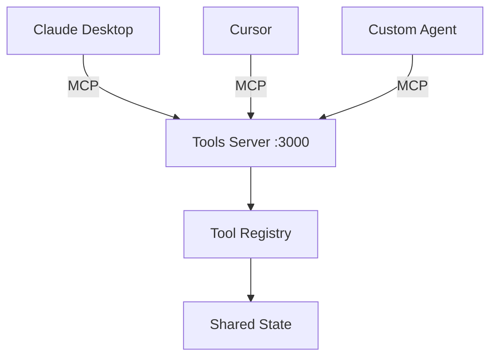

## MCP Protocol

Model Context Protocol (MCP) is a standardized protocol developed by Anthropic for AI agent-to-tool communication using JSON-RPC 2.0 over various transports.

automagik-tools implements MCP via the FastMCP library.

## Architecture



## Tool Discovery

When you run `uvx automagik-tools list`:

1. Scans `automagik_tools/tools/` directory
2. Loads Python modules
3. Extracts `@tool` decorators
4. Returns tool metadata as JSON-RPC response

## Transport Modes

| Mode | Protocol | Connection | Latency | Use Case |
|------|----------|------------|---------|----------|
| **stdio** | JSON-RPC over stdin/stdout | 1:1 process | ~1ms | Local AI clients |
| **SSE** | JSON-RPC over HTTP long-polling | Many:1 server | ~50ms | Team sharing |
| **HTTP** | JSON-RPC over HTTP REST | Stateless | ~100ms | API integrations |

## Communication Flow

1. **Server Startup**
   ```bash
   uvx automagik-tools serve --tools all
   # - Starts MCP server
   # - Loads tools from automagik_tools/tools/
   # - Registers tools in registry
   ```

2. **Agent Connection**
   ```json
   // Claude Desktop config
   {
     "mcpServers": {
       "automagik-tools": {
         "command": "uvx",
         "args": ["automagik-tools", "serve"]
       }
     }
   }
   ```

3. **Tool Discovery**
   ```json
   // Request
   {
     "jsonrpc": "2.0",
     "method": "tools/list",
     "id": 1
   }

   // Response
   {
     "jsonrpc": "2.0",
     "result": {
       "tools": [
         {
           "name": "genie_execute",
           "description": "Universal orchestrator",
           "parameters": {...}
         }
       ]
     },
     "id": 1
   }
   ```

4. **Tool Invocation**
   ```json
   // Request
   {
     "jsonrpc": "2.0",
     "method": "tools/call",
     "params": {
       "name": "genie_execute",
       "arguments": {"instruction": "..."}
     },
     "id": 2
   }

   // Response
   {
     "jsonrpc": "2.0",
     "result": {...},
     "id": 2
   }
   ```

## Tool Categories

### Built-in Tools (8)

Pre-built integrations in `automagik_tools/tools/`:

- genie: Universal orchestrator
- automagik: Suite integration
- evolution-api: WhatsApp automation
- automagik-workflows: Claude workflows
- omni: Multi-channel messaging
- spark: Temporal automation
- gemini-assistant: Gemini integration
- json-to-google-docs: Document generation

### Generated Tools

Created from OpenAPI specs:

```bash
automagik-tools generate \
  --spec https://api.github.com/openapi.json \
  --name github

# Generates tools/github/ with all endpoints as @tool functions
```

### Plugin Tools

User-created tools in `~/.automagik/tools/plugins/`:

```python
from automagik_tools import tool

@tool(name="custom_tool")
def custom_operation(param: str) -> dict:
    return {"result": f"Processed {param}"}
```

## Parameter Validation

All tools include JSON Schema validation:

```json
{
  "name": "send_message",
  "parameters": {
    "type": "object",
    "properties": {
      "phone": {
        "type": "string",
        "pattern": "^\\+[1-9]\\d{1,14}$"
      },
      "message": {
        "type": "string",
        "minLength": 1,
        "maxLength": 4096
      }
    },
    "required": ["phone", "message"]
  }
}
```

Invalid calls are rejected with `ValidationError` before execution.

## Multi-Agent Support

Multiple agents can connect to the same server instance:



## Security

### Tool-Level Authentication

Each tool manages its own credentials via environment variables:

```bash
export GITHUB_TOKEN=ghp_xxx
export SLACK_TOKEN=xoxb-xxx
uvx automagik-tools serve
```

### Transport Security

- **stdio**: Local process only, no network exposure
- **SSE**: Supports HTTPS + bearer token authentication
- **HTTP**: Supports HTTPS + API key authentication

### Isolation

- Tools run in separate contexts
- Cannot access each other's data
- Memory scoped per tool
- Credentials isolated per integration

## Performance

### Lazy Loading

```python
# Server start: ~200ms
# Tools loaded on-demand:
# - genie: 50ms
# - evolution-api: 120ms
# - Generated tools: 80-150ms
```

### Caching

OpenAPI specs and generated code are cached:

- First generation: 8-15 seconds
- Subsequent uses: <100ms

Cache TTL: 24 hours

### Parallel Execution

Multiple tool calls execute concurrently:

```python
# All three execute in parallel
await asyncio.gather(
    genie_execute(),
    evolution_send(),
    omni_notify()
)
```

## Next Steps

- [OpenAPI Generation](/tools/concepts/openapi-generation): How OpenAPI specs become MCP tools
- [Transport Modes](/tools/concepts/transport-modes): Technical comparison of stdio, SSE, HTTP
- [Plugin System](/tools/concepts/plugin-system): Tool discovery and loading mechanism
