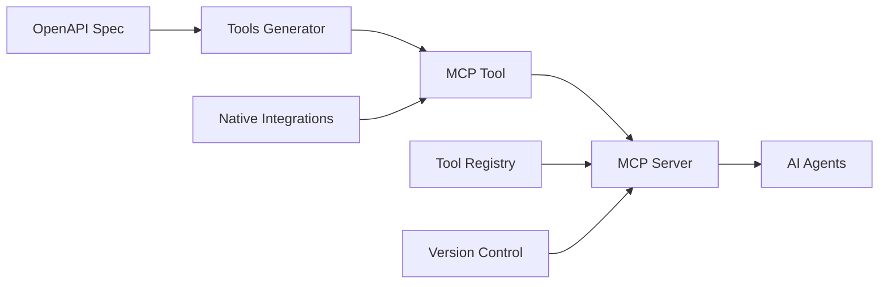

  <h1 style={{ fontSize: '2.5rem', fontWeight: '300', marginBottom: '1rem' }}>
    From API to AI
  </h1>
  <h1 style={{ fontSize: '2.5rem', fontWeight: '300', marginTop: '0' }}>
    in 30 Seconds
  </h1>

## What is Tools?

Tools is the **architect of intelligent tools** - transforming any API into an MCP (Model Context Protocol) tool in 30 seconds. Auto-generate, optimize, and centralize tools for AI agents. From API to AI-ready in one command.

## The Problem

Connecting APIs to AI agents is manual and time-consuming:
- **Custom Code**: Every API requires hand-written integration
- **No Standards**: Different protocols for every service
- **Maintenance Burden**: APIs change, integrations break
- **Duplication**: Same integrations written multiple times
- **No Discovery**: Hard to find available tools

## The Solution

Tools provides **instant API-to-AI transformation**:

<CardGroup cols={2}>
  <Card title="Auto-Generation" icon="wand-magic-sparkles">
    Point at an OpenAPI spec, get a fully functional MCP tool in seconds.
  </Card>
  <Card title="9 Native Integrations" icon="puzzle-piece">
    Common services already integrated - GitHub, Slack, Stripe, and more.
  </Card>
  <Card title="Deploy via uvx" icon="rocket">
    One command deployment. No complex setup required.
  </Card>
  <Card title="Universal Compatibility" icon="plug">
    Connect any API to any AI agent instantly via MCP protocol.
  </Card>
</CardGroup>

## Key Features

### 🔧 MCP Tool Generation
Transform APIs into AI tools automatically:
- **OpenAPI Support**: Parse OpenAPI/Swagger specs
- **Type Safety**: Generated tools are fully typed
- **Documentation**: Auto-generated from API docs
- **Validation**: Request/response validation built-in

### 📦 Pre-Built Integrations
Common services ready to use:
- **Communication**: Slack, Discord, Email
- **Development**: GitHub, GitLab, Linear
- **Business**: Stripe, HubSpot, Salesforce
- **More**: Growing library of integrations

### 🚀 Instant Deployment
- **uvx Deployment**: `uvx automagik-tools` and you're live
- **No Config Files**: Sensible defaults that just work
- **Hot Reload**: Update tools without restarts
- **Multi-Tenant**: Serve multiple clients from one instance

### 🔍 Tool Discovery
- **Centralized Registry**: Find available tools easily
- **Semantic Search**: Discover tools by capability
- **Usage Examples**: Every tool comes with examples
- **Version Management**: Track and manage tool versions

## Who is Tools For?

<AccordionGroup>
  <Accordion title="AI Agent Developers">
    Stop writing integrations from scratch. Generate them in seconds.
  </Accordion>
  <Accordion title="API Providers">
    Make your API AI-ready instantly. Expand to AI use cases.
  </Accordion>
  <Accordion title="Integration Teams">
    Build and maintain tool libraries for your organization.
  </Accordion>
  <Accordion title="Platform Engineers">
    Deploy centralized tool services for multiple teams and agents.
  </Accordion>
</AccordionGroup>

## Why "Tools"?

The right **tool** makes any job easier - and that's exactly what this provides. It's the **universal toolbox** that gives AI agents access to any API through standardized, reliable tools.

## Architecture

## How It Works

<Steps>
  <Step title="Provide OpenAPI Spec">
    Point Tools at any OpenAPI/Swagger specification URL.
  </Step>
  <Step title="Generate MCP Tool">
    Tools analyzes the spec and generates a complete MCP tool with types and validation.
  </Step>
  <Step title="Deploy">
    Run `uvx automagik-tools` and your tool is live and ready for AI agents.
  </Step>
  <Step title="Use with Any Agent">
    Any MCP-compatible AI agent can now use your API through the generated tool.
  </Step>
</Steps>

## Use Cases

<CardGroup cols={2}>
  <Card title="API Exposure" icon="cloud">
    Make your internal APIs accessible to AI agents company-wide.
  </Card>
  <Card title="Integration Hub" icon="diagram-project">
    Create a central tool registry for all your services.
  </Card>
  <Card title="Rapid Prototyping" icon="bolt">
    Test AI agent capabilities with any API in minutes.
  </Card>
  <Card title="Tool Marketplace" icon="store">
    Build and share tools with the community.
  </Card>
</CardGroup>

## Pre-Built Integrations

Tools comes with 9 native integrations ready to use:

<CardGroup cols={3}>
  <Card title="GitHub" icon="github">
    Issues, PRs, repos, and more
  </Card>
  <Card title="Slack" icon="slack">
    Channels, messages, users
  </Card>
  <Card title="Stripe" icon="stripe">
    Payments, subscriptions, customers
  </Card>
  <Card title="Discord" icon="discord">
    Servers, channels, roles
  </Card>
  <Card title="Linear" icon="l">
    Issues, projects, teams
  </Card>
  <Card title="HubSpot" icon="h">
    CRM, contacts, deals
  </Card>
</CardGroup>

## Philosophy

Tools embodies our core philosophy:

<Card title="AI that elevates human potential, not replaces it" icon="users">
  - **You define APIs** - Tools generates
  - **You deploy** - Tools manages
  - **You extend** - Tools standardizes
  - **You own** - Tools empowers
</Card>

---

## Next Steps

<CardGroup cols={2}>
  <Card title="Installation" icon="download" href="/tools/installation">
    Get Tools installed and configured
  </Card>
  <Card title="Quick Start" icon="rocket" href="/tools/quickstart">
    Generate your first MCP tool
  </Card>
  <Card title="GitHub Repository" icon="github" href="https://github.com/namastexlabs/automagik-tools">
    View source code and contribute
  </Card>
  <Card title="PyPI Package" icon="python" href="https://pypi.org/project/automagik-tools">
    Install via PyPI
  </Card>
</CardGroup>
