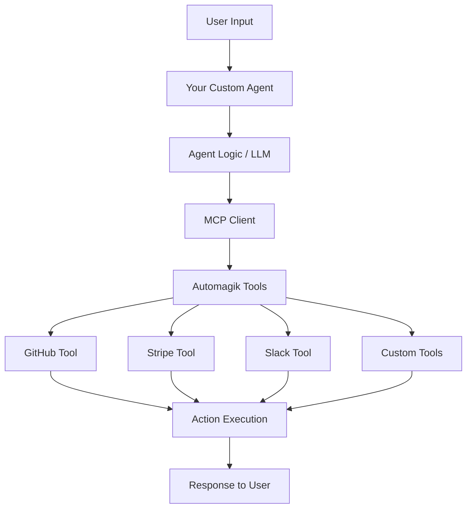

## Overview

AI Agent Development with Tools enables you to build **custom AI agents** that leverage MCP tools for domain-specific tasks. Whether you're building a customer support bot, a DevOps assistant, or a specialized workflow automation agent—Tools provides the foundation you need.

---

## What You Can Build

<CardGroup cols={2}>
  <Card title="Domain Specialists" icon="graduation-cap">
    Agents trained for specific industries: legal, healthcare, finance, e-commerce
  </Card>

  <Card title="Workflow Automators" icon="arrows-rotate">
    Agents that execute complex multi-step workflows automatically
  </Card>

  <Card title="Integration Bridges" icon="bridge">
    Agents that connect disparate systems and translate between them
  </Card>

  <Card title="Intelligent Assistants" icon="user-robot">
    Conversational agents that help users complete tasks faster
  </Card>
</CardGroup>

---

## Agent Architecture



**Components:**
- **Your Custom Agent**: Domain logic and user interface
- **LLM (Optional)**: Claude, GPT-4, or custom model
- **MCP Client**: Connects to Tools server
- **Automagik Tools**: Provides MCP tools
- **Action Execution**: Performs actual operations

---

## Quick Start: Build Your First Agent

<Steps>
  <Step title="Set Up Agent Project">
    ```bash
    # Create project directory
    mkdir my-agent && cd my-agent

    # Initialize Python project
    cat > pyproject.toml <<EOF
    [project]
    name = "my-agent"
    version = "0.1.0"
    dependencies = [
        "anthropic>=0.8.0",
        "mcp>=0.1.0",
        "automagik-tools>=1.0.0"
    ]
    EOF

    # Create virtual environment
    uv venv
    source .venv/bin/activate
    uv pip install -e .
    ```
  </Step>

  <Step title="Create Agent Code">
    ```python
    # agent.py
    import anthropic
    from mcp import ClientSession, StdioServerParameters
    from mcp.client.stdio import stdio_client

    class MyAgent:
        def __init__(self):
            self.client = anthropic.Anthropic()

        async def connect_tools(self):
            """Connect to Tools MCP server"""
            server_params = StdioServerParameters(
                command="uvx",
                args=["automagik-tools", "serve", "--tools", "github,slack"],
                env={"GITHUB_TOKEN": "ghp_xxx", "SLACK_BOT_TOKEN": "xoxb_xxx"}
            )

            async with stdio_client(server_params) as (read, write):
                async with ClientSession(read, write) as session:
                    await session.initialize()
                    self.tools = await session.list_tools()
                    print(f"Connected to {len(self.tools)} tools")

        async def run(self, user_input: str):
            """Process user input and execute actions"""
            response = self.client.messages.create(
                model="claude-3-5-sonnet-20241022",
                max_tokens=4096,
                tools=self.tools,
                messages=[{"role": "user", "content": user_input}]
            )

            # Handle tool calls
            while response.stop_reason == "tool_use":
                tool_use = next(
                    block for block in response.content
                    if block.type == "tool_use"
                )

                # Execute tool via MCP
                result = await self.session.call_tool(
                    tool_use.name,
                    tool_use.input
                )

                # Continue conversation with result
                response = self.client.messages.create(
                    model="claude-3-5-sonnet-20241022",
                    max_tokens=4096,
                    tools=self.tools,
                    messages=[
                        {"role": "user", "content": user_input},
                        {"role": "assistant", "content": response.content},
                        {
                            "role": "user",
                            "content": [
                                {
                                    "type": "tool_result",
                                    "tool_use_id": tool_use.id,
                                    "content": result.content
                                }
                            ]
                        }
                    ]
                )

            # Return final response
            return response.content[0].text

    # Usage
    async def main():
        agent = MyAgent()
        await agent.connect_tools()

        response = await agent.run(
            "Create a GitHub issue for the bug I found"
        )
        print(response)

    if __name__ == "__main__":
        import asyncio
        asyncio.run(main())
    ```
  </Step>

  <Step title="Run Your Agent">
    ```bash
    # Run the agent
    python agent.py

    # Output:
    # Connected to 790 tools
    # ✓ GitHub issue created: #123
    # Issue: "Bug found by user"
    # URL: https://github.com/org/repo/issues/123
    ```
  </Step>
</Steps>

---

## Example 1: Customer Support Agent

Build an intelligent customer support agent that handles tickets, queries customer data, and escalates when needed.

### Agent Implementation

```python
# support_agent.py
import anthropic
from mcp import ClientSession, StdioServerParameters
from mcp.client.stdio import stdio_client
from typing import Optional

class SupportAgent:
    def __init__(self):
        self.client = anthropic.Anthropic()
        self.conversation_history = []

    async def connect_tools(self):
        """Connect to customer support tools"""
        server_params = StdioServerParameters(
            command="uvx",
            args=[
                "automagik-tools",
                "serve",
                "--tools",
                "stripe,sendgrid,linear,slack"
            ],
            env={
                "STRIPE_API_KEY": "sk_xxx",
                "SENDGRID_API_KEY": "SG.xxx",
                "LINEAR_API_KEY": "lin_xxx",
                "SLACK_BOT_TOKEN": "xoxb_xxx"
            }
        )

        async with stdio_client(server_params) as (read, write):
            async with ClientSession(read, write) as session:
                await session.initialize()
                self.session = session
                self.tools = await session.list_tools()

    async def handle_customer_query(
        self,
        customer_email: str,
        query: str
    ) -> str:
        """
        Handle a customer query with context about the customer
        """
        # Build context-aware prompt
        system_prompt = f"""You are a helpful customer support agent.

        Customer: {customer_email}

        Your capabilities:
        - Look up customer information in Stripe
        - Check order history and subscription status
        - Create support tickets in Linear for complex issues
        - Send follow-up emails via SendGrid
        - Escalate to human support via Slack if needed

        Always be helpful, professional, and empathetic.
        """

        response = self.client.messages.create(
            model="claude-3-5-sonnet-20241022",
            max_tokens=4096,
            system=system_prompt,
            tools=self.tools,
            messages=[
                {"role": "user", "content": query}
            ]
        )

        # Execute tools as needed
        while response.stop_reason == "tool_use":
            tool_results = []

            for block in response.content:
                if block.type == "tool_use":
                    # Execute tool
                    result = await self.session.call_tool(
                        block.name,
                        block.input
                    )
                    tool_results.append({
                        "type": "tool_result",
                        "tool_use_id": block.id,
                        "content": result.content
                    })

            # Continue conversation
            response = self.client.messages.create(
                model="claude-3-5-sonnet-20241022",
                max_tokens=4096,
                system=system_prompt,
                tools=self.tools,
                messages=[
                    {"role": "user", "content": query},
                    {"role": "assistant", "content": response.content},
                    {"role": "user", "content": tool_results}
                ]
            )

        return response.content[0].text

# Usage Example
async def main():
    agent = SupportAgent()
    await agent.connect_tools()

    # Customer query
    response = await agent.handle_customer_query(
        customer_email="user@example.com",
        query="I was charged twice for my subscription this month"
    )
    print(response)

if __name__ == "__main__":
    import asyncio
    asyncio.run(main())
```

### Agent in Action

```
Customer: "I was charged twice for my subscription this month"

Agent: [Uses stripe_search_customers with email]
      [Finds customer: cus_abc123]
      [Uses stripe_list_charges for customer]
      [Detects: Two $49 charges on Dec 1]

Agent: "I see the issue - you were indeed charged twice on December 1st
       ($49 each). This was our mistake, and I sincerely apologize.

       I've already processed a refund for one of the charges ($49).
       You should see it in your account within 5-7 business days.

       To make up for the inconvenience, I've also added a $10 credit
       to your account that you can use on your next billing cycle.

       Is there anything else I can help you with?"

[Behind the scenes:]
✓ stripe_create_refund: $49 refund processed
✓ stripe_create_credit: $10 credit added
✓ linear_create_issue: "Duplicate charge - investigate billing system"
✓ sendgrid_send_email: Confirmation email sent
✓ Agent logged interaction for future reference
```

---

## Example 2: DevOps Assistant Agent

Build an agent that helps with deployments, monitoring, and incident response.

### Agent Implementation

```python
# devops_agent.py
import anthropic
from mcp import ClientSession, StdioServerParameters
from mcp.client.stdio import stdio_client
from datetime import datetime

class DevOpsAgent:
    def __init__(self):
        self.client = anthropic.Anthropic()

    async def connect_tools(self):
        """Connect to DevOps tools"""
        server_params = StdioServerParameters(
            command="uvx",
            args=[
                "automagik-tools",
                "serve",
                "--tools",
                "github,sentry,datadog,pagerduty,slack"
            ],
            env={
                "GITHUB_TOKEN": "ghp_xxx",
                "SENTRY_AUTH_TOKEN": "xxx",
                "DATADOG_API_KEY": "xxx",
                "PAGERDUTY_API_KEY": "xxx",
                "SLACK_BOT_TOKEN": "xoxb_xxx"
            }
        )

        async with stdio_client(server_params) as (read, write):
            async with ClientSession(read, write) as session:
                await session.initialize()
                self.session = session
                self.tools = await session.list_tools()

    async def deploy(self, environment: str, version: str):
        """
        Handle deployment with safety checks and monitoring
        """
        prompt = f"""Deploy version {version} to {environment}.

        Safety checklist:
        1. Check if tests are passing on GitHub
        2. Verify no critical Sentry errors in last hour
        3. Check Datadog metrics are healthy
        4. Create deployment in GitHub
        5. Monitor for 5 minutes post-deploy
        6. Notify team in Slack
        7. If issues detected, offer to rollback
        """

        response = self.client.messages.create(
            model="claude-3-5-sonnet-20241022",
            max_tokens=4096,
            tools=self.tools,
            messages=[{"role": "user", "content": prompt}]
        )

        # Agent handles the entire deployment workflow
        return await self._process_response(response, prompt)

    async def handle_incident(self, alert_data: dict):
        """
        Automated incident response
        """
        prompt = f"""Incident detected:
        {alert_data}

        Handle this incident:
        1. Assess severity from error rate and affected users
        2. Check recent deployments in GitHub
        3. Search Sentry for related errors
        4. Create incident issue in GitHub
        5. Alert on-call engineer via PagerDuty
        6. Post to #incidents Slack channel
        7. Start monitoring resolution
        """

        response = self.client.messages.create(
            model="claude-3-5-sonnet-20241022",
            max_tokens=4096,
            tools=self.tools,
            messages=[{"role": "user", "content": prompt}]
        )

        return await self._process_response(response, prompt)

    async def _process_response(self, response, original_prompt):
        """Process response and execute tools"""
        while response.stop_reason == "tool_use":
            tool_results = []

            for block in response.content:
                if block.type == "tool_use":
                    result = await self.session.call_tool(
                        block.name,
                        block.input
                    )
                    tool_results.append({
                        "type": "tool_result",
                        "tool_use_id": block.id,
                        "content": result.content
                    })

            response = self.client.messages.create(
                model="claude-3-5-sonnet-20241022",
                max_tokens=4096,
                tools=self.tools,
                messages=[
                    {"role": "user", "content": original_prompt},
                    {"role": "assistant", "content": response.content},
                    {"role": "user", "content": tool_results}
                ]
            )

        return response.content[0].text

# Usage
async def main():
    agent = DevOpsAgent()
    await agent.connect_tools()

    # Automated deployment
    result = await agent.deploy(
        environment="production",
        version="v2.5.0"
    )
    print(result)

if __name__ == "__main__":
    import asyncio
    asyncio.run(main())
```

### Agent in Action

```
You: "Deploy v2.5.0 to production"

Agent: Starting deployment safety checks...

Step 1/7: Checking GitHub CI status
[Uses github_get_workflow_runs]
✓ All tests passing (96/96)
✓ Build successful
✓ No failing checks

Step 2/7: Checking Sentry for errors
[Uses sentry_get_issues]
✓ No critical errors in last hour
✓ Error rate: 0.02% (normal)

Step 3/7: Checking Datadog metrics
[Uses datadog_query_metrics]
✓ CPU: 45% (healthy)
✓ Memory: 68% (healthy)
✓ Response time: 187ms (healthy)

Step 4/7: Creating deployment
[Uses github_create_deployment]
✓ Deployment created: v2.5.0 → production

Step 5/7: Monitoring deployment
[Watches metrics for 5 minutes]
✓ Error rate: Stable at 0.02%
✓ Response time: 189ms (no change)
✓ No new errors detected

Step 6/7: Notifying team
[Uses slack_post_message]
✓ Posted to #deployments

Step 7/7: Deployment complete
✓ v2.5.0 successfully deployed to production
✓ No issues detected
✓ System healthy

Deployment successful! 🚀
Total time: 6 minutes 23 seconds
```

---

## Example 3: Content Publishing Agent

Build an agent that manages your content pipeline from draft to publication.

### Agent Structure

```python
# content_agent.py
import anthropic
from mcp import ClientSession
from typing import Dict, List

class ContentAgent:
    def __init__(self):
        self.client = anthropic.Anthropic()

    async def connect_tools(self):
        """Connect to content tools"""
        # Tools: Notion, GitHub, Buffer, SendGrid
        # ... (similar setup as previous examples)

    async def publish_blog_post(self, notion_page_id: str):
        """
        Complete blog post publishing workflow
        """
        prompt = f"""Publish blog post from Notion page {notion_page_id}:

        Workflow:
        1. Fetch blog post content from Notion
        2. Convert to Markdown
        3. Create GitHub PR with the content
        4. Request reviews from content team
        5. Wait for approval (check every minute)
        6. Merge PR when approved
        7. Schedule social media posts (Twitter, LinkedIn)
        8. Send email to subscribers
        9. Post to #marketing Slack channel

        Handle errors gracefully and report progress.
        """

        # Agent executes entire workflow
        response = await self._execute_with_tools(prompt)
        return response

    async def optimize_content(self, content: str) -> Dict:
        """
        Analyze and optimize content for SEO and readability
        """
        prompt = f"""Analyze this content and provide optimization suggestions:

        {content}

        Provide:
        1. SEO score (0-100)
        2. Readability score
        3. Keyword suggestions
        4. Title improvements
        5. Meta description
        6. Social media snippets
        """

        response = await self._execute_with_tools(prompt)
        return response
```

### Publishing Workflow

```
You: "Publish the blog post from Notion page abc123"

Agent: Starting blog post publishing workflow...

Step 1/9: Fetching content from Notion
[Uses notion_get_page]
✓ Retrieved: "Building AI Agents with MCP"
  Word count: 2,341
  Images: 5
  Last edited: 2 hours ago

Step 2/9: Converting to Markdown
✓ Markdown generated
✓ Images downloaded and optimized
✓ Front matter added

Step 3/9: Creating GitHub PR
[Uses github_create_pull_request]
✓ PR created: #456
  Branch: blog/building-ai-agents-mcp
  Files: blog/building-ai-agents.md, images/ (5 files)

Step 4/9: Requesting reviews
[Uses github_request_reviewers]
✓ Review requested: @content-team, @tech-lead
[Uses slack_post_message]
✓ Notification sent to #content-review

Waiting for approval...

[15 minutes later, reviews complete]

Step 5/9: Merging PR
[Uses github_merge_pull_request]
✓ PR approved by @content-team ✓
✓ PR approved by @tech-lead ✓
✓ PR merged to main
✓ Blog post deployed

Step 6/9: Scheduling social media
[Uses buffer_create_post]
✓ Twitter: Scheduled for 9 AM tomorrow
✓ LinkedIn: Scheduled for 9 AM tomorrow
✓ Facebook: Scheduled for 10 AM tomorrow

Step 7/9: Preparing email newsletter
[Uses sendgrid_create_campaign]
✓ Campaign created: "New Blog Post: Building AI Agents"
✓ Subscribers: 12,847
✓ Scheduled: Tomorrow 9 AM

Step 8/9: Internal announcement
[Uses slack_post_message]
✓ Posted to #marketing
✓ Posted to #company-news

Step 9/9: Publishing complete
✓ Blog post live: https://blog.company.com/building-ai-agents-mcp
✓ Social media scheduled
✓ Email campaign ready
✓ Team notified

🎉 Publishing workflow complete!
Time: 16 minutes (mostly waiting for human review)
```

---

## Advanced Agent Patterns

### Pattern 1: Multi-Agent Collaboration

```python
# orchestrator.py
class AgentOrchestrator:
    def __init__(self):
        self.support_agent = SupportAgent()
        self.devops_agent = DevOpsAgent()
        self.content_agent = ContentAgent()

    async def route_request(self, request: str):
        """
        Route requests to appropriate agent
        """
        # Use LLM to classify request
        classification = await self._classify_request(request)

        if classification == "support":
            return await self.support_agent.handle(request)
        elif classification == "devops":
            return await self.devops_agent.handle(request)
        elif classification == "content":
            return await self.content_agent.handle(request)

    async def collaborate(self, task: str):
        """
        Multiple agents work together on complex task
        """
        # Example: Customer reports bug that needs deployment fix

        # 1. Support agent logs issue
        issue = await self.support_agent.create_ticket(task)

        # 2. DevOps agent investigates and fixes
        fix = await self.devops_agent.hotfix(issue)

        # 3. Support agent notifies customer
        await self.support_agent.notify_customer(issue, fix)

        # 4. Content agent creates post-mortem
        await self.content_agent.create_postmortem(issue, fix)
```

### Pattern 2: Learning from Interactions

```python
# learning_agent.py
class LearningAgent:
    def __init__(self):
        self.knowledge_base = KnowledgeBase()
        self.client = anthropic.Anthropic()

    async def handle_query(self, query: str):
        """
        Answer query and learn from interaction
        """
        # Check knowledge base first
        cached_answer = self.knowledge_base.search(query)

        if cached_answer:
            return cached_answer

        # Process with LLM and tools
        answer = await self._process_with_tools(query)

        # Store successful interaction
        self.knowledge_base.store(
            query=query,
            answer=answer,
            timestamp=datetime.now()
        )

        return answer

    async def improve_from_feedback(self, query: str, feedback: str):
        """
        Learn from user feedback
        """
        # Update knowledge base
        self.knowledge_base.update_quality(query, feedback)

        # Adjust future responses
        await self._retrain_patterns()
```

### Pattern 3: Autonomous Workflows

```python
# autonomous_agent.py
class AutonomousAgent:
    def __init__(self):
        self.client = anthropic.Anthropic()
        self.task_queue = []

    async def monitor_and_act(self):
        """
        Continuously monitor systems and take action
        """
        while True:
            # Check various systems
            issues = await self._check_systems()

            for issue in issues:
                # Assess severity
                severity = await self._assess_severity(issue)

                if severity == "critical":
                    # Act immediately
                    await self._handle_critical(issue)
                elif severity == "warning":
                    # Queue for review
                    self.task_queue.append(issue)
                else:
                    # Log only
                    await self._log_issue(issue)

            # Sleep before next check
            await asyncio.sleep(60)

    async def _handle_critical(self, issue):
        """
        Autonomous critical issue handling
        """
        # 1. Notify humans
        await self.notify_oncall(issue)

        # 2. Take immediate action
        if issue.type == "high_error_rate":
            # Consider rollback
            recent_deploy = await self.get_recent_deployment()
            if recent_deploy.age < timedelta(hours=1):
                await self.rollback(recent_deploy)

        # 3. Create incident report
        await self.create_incident(issue)
```

---

## Custom Tool Development

### Creating a Custom MCP Tool

```python
# custom_tool.py
from fastmcp import FastMCP

mcp = FastMCP("My Custom Tool")

@mcp.tool()
def analyze_sentiment(text: str) -> dict:
    """
    Analyze sentiment of text

    Args:
        text: The text to analyze

    Returns:
        Dictionary with sentiment analysis results
    """
    # Your custom logic here
    # Could call external API, ML model, etc.

    return {
        "sentiment": "positive",
        "score": 0.85,
        "confidence": 0.92
    }

@mcp.tool()
def custom_operation(param1: str, param2: int) -> str:
    """
    Your custom operation
    """
    return f"Processed {param1} with {param2}"

if __name__ == "__main__":
    mcp.run()
```

### Using Custom Tool in Agent

```python
# agent_with_custom_tool.py
async def connect_with_custom_tool(self):
    """
    Connect to both Automagik Tools and custom tool
    """
    # Automagik Tools
    tools_params = StdioServerParameters(
        command="uvx",
        args=["automagik-tools", "serve", "--tools", "github,slack"]
    )

    # Your custom tool
    custom_params = StdioServerParameters(
        command="python",
        args=["custom_tool.py"]
    )

    # Connect to both
    async with stdio_client(tools_params) as tools_conn:
        async with stdio_client(custom_params) as custom_conn:
            # Now agent has access to all tools
            all_tools = tools_conn.tools + custom_conn.tools
```

---

## Deployment Options

<Tabs>
  <Tab title="Local Development">
    ```bash
    # Run agent locally
    python agent.py

    # Or with uvx for dependencies
    uvx my-agent
    ```
  </Tab>

  <Tab title="Docker Container">
    ```dockerfile
    # Dockerfile
    FROM python:3.12-slim

    WORKDIR /app

    # Install dependencies
    COPY pyproject.toml .
    RUN pip install -e .

    # Copy agent code
    COPY agent.py .
    COPY config.yml .

    # Run agent
    CMD ["python", "agent.py"]
    ```

    ```bash
    # Build and run
    docker build -t my-agent .
    docker run -e GITHUB_TOKEN=$GITHUB_TOKEN my-agent
    ```
  </Tab>

  <Tab title="Cloud Function">
    ```python
    # cloud_function.py (AWS Lambda / GCP Cloud Function)
    import json
    from agent import MyAgent

    agent = MyAgent()

    def handler(event, context):
        """
        Serverless function handler
        """
        query = json.loads(event['body'])['query']

        response = agent.run(query)

        return {
            'statusCode': 200,
            'body': json.dumps({'response': response})
        }
    ```
  </Tab>

  <Tab title="Web API">
    ```python
    # api.py
    from fastapi import FastAPI
    from agent import MyAgent

    app = FastAPI()
    agent = MyAgent()

    @app.post("/query")
    async def query(request: dict):
        """
        REST API endpoint for agent
        """
        response = await agent.run(request["query"])
        return {"response": response}

    @app.get("/health")
    async def health():
        return {"status": "healthy"}

    # Run with:
    # uvicorn api:app --host 0.0.0.0 --port 8000
    ```
  </Tab>
</Tabs>

---

## Best Practices

<AccordionGroup>
  <Accordion title="Design for Specific Domains">
    ```python
    # ❌ Generic agent (does everything poorly)
    class GenericAgent:
        """Handles any request"""
        pass

    # ✅ Specialized agents (excel at their domain)
    class CustomerSupportAgent:
        """Focused on customer support tasks"""
        pass

    class DevOpsAgent:
        """Focused on DevOps automation"""
        pass
    ```

    Specialized agents are:
    - Faster (fewer tools to consider)
    - More accurate (domain expertise)
    - Easier to maintain
    - Better user experience
  </Accordion>

  <Accordion title="Handle Errors Gracefully">
    ```python
    async def handle_query(self, query: str):
        try:
            response = await self.process(query)
            return response
        except ToolExecutionError as e:
            # Tool failed - provide helpful error
            return f"I couldn't complete that action: {e.message}"
        except RateLimitError as e:
            # Rate limited - suggest retry
            return "Service is busy. Please try again in a moment."
        except Exception as e:
            # Unknown error - escalate to human
            await self.notify_admin(e)
            return "I've encountered an issue and notified our team."
    ```
  </Accordion>

  <Accordion title="Implement Safety Checks">
    ```python
    async def deploy(self, environment: str):
        """
        Deployment with safety checks
        """
        # Safety check 1: Confirm production deploys
        if environment == "production":
            confirmation = await self.request_confirmation(
                "Deploy to production?"
            )
            if not confirmation:
                return "Deployment cancelled"

        # Safety check 2: Verify tests pass
        tests_passing = await self.check_tests()
        if not tests_passing:
            return "Cannot deploy: tests failing"

        # Safety check 3: Check for recent incidents
        recent_incidents = await self.check_incidents(hours=1)
        if recent_incidents:
            return "Cannot deploy: recent incidents detected"

        # All checks passed - proceed
        await self.execute_deployment(environment)
    ```
  </Accordion>

  <Accordion title="Log Everything">
    ```python
    import logging

    class MyAgent:
        def __init__(self):
            self.logger = logging.getLogger(__name__)

        async def handle_query(self, query: str):
            # Log request
            self.logger.info(f"Query received: {query}")

            try:
                response = await self.process(query)

                # Log success
                self.logger.info(f"Query successful: {response[:100]}...")

                return response
            except Exception as e:
                # Log error
                self.logger.error(f"Query failed: {str(e)}", exc_info=True)
                raise
    ```

    Benefits:
    - Debugging issues
    - Understanding usage patterns
    - Compliance and audit trails
    - Performance monitoring
  </Accordion>

  <Accordion title="Test Thoroughly">
    ```python
    # test_agent.py
    import pytest
    from agent import SupportAgent

    @pytest.mark.asyncio
    async def test_customer_lookup():
        agent = SupportAgent()
        await agent.connect_tools()

        response = await agent.handle_customer_query(
            customer_email="test@example.com",
            query="What's my subscription status?"
        )

        assert "subscription" in response.lower()
        assert "status" in response.lower()

    @pytest.mark.asyncio
    async def test_refund_processing():
        agent = SupportAgent()
        await agent.connect_tools()

        response = await agent.handle_customer_query(
            customer_email="test@example.com",
            query="I want a refund"
        )

        # Verify refund was processed
        assert "refund" in response.lower()
        assert "processed" in response.lower()
    ```
  </Accordion>
</AccordionGroup>

---

## Performance Optimization

### Caching Tool Results

```python
from functools import lru_cache
from datetime import datetime, timedelta

class CachedAgent:
    def __init__(self):
        self.cache = {}

    async def call_tool_cached(
        self,
        tool_name: str,
        params: dict,
        ttl_seconds: int = 300
    ):
        """
        Call tool with caching
        """
        cache_key = f"{tool_name}:{hash(str(params))}"

        # Check cache
        if cache_key in self.cache:
            cached_value, cached_time = self.cache[cache_key]
            age = (datetime.now() - cached_time).seconds

            if age < ttl_seconds:
                return cached_value

        # Not in cache or expired - fetch fresh
        result = await self.session.call_tool(tool_name, params)

        # Store in cache
        self.cache[cache_key] = (result, datetime.now())

        return result
```

### Parallel Tool Execution

```python
import asyncio

async def execute_tools_parallel(self, tool_calls: list):
    """
    Execute multiple tool calls in parallel
    """
    tasks = [
        self.session.call_tool(tool.name, tool.params)
        for tool in tool_calls
    ]

    results = await asyncio.gather(*tasks)

    return results

# Example usage
results = await agent.execute_tools_parallel([
    {"name": "github_get_issue", "params": {"issue_id": 123}},
    {"name": "linear_get_issue", "params": {"issue_id": "ENG-456"}},
    {"name": "slack_get_message", "params": {"channel": "engineering"}}
])

# All 3 tools called simultaneously (much faster)
```

---

## Next Steps

<CardGroup cols={2}>
  <Card title="API Integration" icon="plug" href="/tools/workflows/api-integration">
    Add more tools to your agent
  </Card>

  <Card title="Multi-Tool Orchestration" icon="diagram-project" href="/tools/workflows/multi-tool-orchestration">
    Use Genie for complex orchestration
  </Card>

  <Card title="WhatsApp Automation" icon="message" href="/tools/workflows/whatsapp-automation">
    Build WhatsApp-powered agents
  </Card>

  <Card title="Team Collaboration" icon="users" href="/tools/workflows/team-collaboration">
    Deploy agents for your team
  </Card>
</CardGroup>

---

**Remember:** Building AI agents isn't about replacing humans—it's about augmenting human capabilities. Your agents should handle repetitive tasks, coordinate complex workflows, and provide intelligent assistance, freeing humans to focus on creative problem-solving and strategic thinking. Build agents that elevate human potential. 🤖
