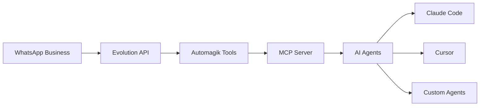
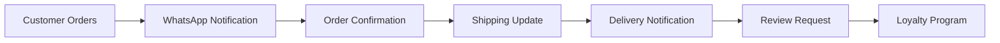

## Overview

WhatsApp automation with Tools transforms your WhatsApp Business account into an intelligent AI-powered assistant. Handle customer support, send notifications, manage groups, and automate conversations—all through natural language with AI agents.

---

## What You Can Build

<CardGroup cols={2}>
  <Card title="Customer Support Bot" icon="headset">
    24/7 automated support that understands context and provides intelligent responses
  </Card>

  <Card title="Order Notifications" icon="bell">
    Real-time updates about orders, deliveries, and shipments directly to customers
  </Card>

  <Card title="Group Management" icon="users">
    Automate group administration, member management, and announcements
  </Card>

  <Card title="Media Handling" icon="image">
    Send and receive images, videos, documents, and voice messages automatically
  </Card>
</CardGroup>

---

## Architecture



**Components:**
- **WhatsApp Business**: Your WhatsApp account
- **Evolution API**: Open-source WhatsApp API bridge
- **Automagik Tools**: MCP tool generator with Evolution API integration
- **AI Agents**: Claude Code, Cursor, or custom agents that use the tools

---

## Quick Start (5 Minutes)

<Steps>
  <Step title="Install Evolution API">
    ```bash
    # Option 1: Docker (Recommended)
    docker run -d \
      --name evolution-api \
      -p 8080:8080 \
      atendai/evolution-api:latest

    # Option 2: Manual installation
    git clone https://github.com/EvolutionAPI/evolution-api
    cd evolution-api
    npm install
    npm run start:prod
    ```
  </Step>

  <Step title="Configure Environment">
    ```bash
    # Create .env file
    cat > .env <<EOF
    EVOLUTION_API_URL=http://localhost:8080
    EVOLUTION_API_KEY=your_evolution_api_key
    EOF
    ```

    Get your API key from Evolution API dashboard at `http://localhost:8080/manager`
  </Step>

  <Step title="Start Tools with Evolution API">
    ```bash
    # Run Tools with Evolution API integration
    uvx automagik-tools serve \
      --tools evolution-api \
      --transport sse \
      --port 3000

    # Tools is now ready to manage WhatsApp!
    ```
  </Step>

  <Step title="Connect WhatsApp">
    Use your AI agent to connect:

    ```
    You: "Create a new WhatsApp instance called 'customer-support'"

    AI: [Uses evolution_create_instance]
    ✓ Instance created: customer-support

    You: "Get QR code to connect WhatsApp"

    AI: [Uses evolution_get_qr_code]
    [QR Code Image Displayed]

    Scan this QR code with WhatsApp to connect.
    ```

    Scan the QR code with WhatsApp → WhatsApp Web → Linked Devices
  </Step>

  <Step title="Start Automating">
    ```
    You: "Send 'Hello!' to +1234567890"

    AI: [Uses evolution_send_text_message]
    ✓ Message sent to +1234567890

    Your WhatsApp bot is live! 🎉
    ```
  </Step>
</Steps>

---

## Use Case 1: Customer Support Automation

Build a 24/7 customer support bot that handles common queries intelligently.

### Setup

<Steps>
  <Step title="Create Support Instance">
    ```
    You: "Create WhatsApp instance for customer support"

    AI: I'll create a dedicated instance.
    [Uses evolution_create_instance with name="customer-support"]
    ✓ Instance created
    [Displays QR code for connection]
    ```
  </Step>

  <Step title="Connect Claude Code">
    Add to Claude Desktop config:

    ```json
    {
      "mcpServers": {
        "whatsapp-support": {
          "command": "uvx",
          "args": [
            "automagik-tools",
            "serve",
            "--tools",
            "evolution-api"
          ],
          "env": {
            "EVOLUTION_API_URL": "http://localhost:8080",
            "EVOLUTION_API_KEY": "your_api_key",
            "EVOLUTION_INSTANCE": "customer-support"
          }
        }
      }
    }
    ```
  </Step>

  <Step title="Configure Auto-Response">
    ```
    You: "When someone messages us, check their message.
         If it's about order status, get order number and look it up.
         If it's about returns, provide return policy.
         If it's technical support, create a support ticket."

    AI: I'll set up intelligent message handling.
    [Creates webhook listener that:
      1. Receives incoming messages
      2. Analyzes message intent
      3. Routes to appropriate handler
      4. Sends contextual response
    ]

    Auto-responder active. Monitoring messages...
    ```
  </Step>
</Steps>

### Real Conversations

<Tabs>
  <Tab title="Order Status Query">
    ```
    Customer: "Hi, what's the status of my order #12345?"

    Bot: [Analyzes message → Detects order status query]
         [Extracts order number: 12345]
         [Uses company_api to check order]

    Bot: "Hi! Your order #12345 is currently in transit.
         Expected delivery: December 15, 2024
         Tracking: https://track.example.com/12345

         Would you like me to send updates when it arrives?"

    Customer: "Yes please"

    Bot: "Perfect! I'll notify you as soon as it's delivered. 📦"
         [Saves notification preference]
    ```
  </Tab>

  <Tab title="Return Request">
    ```
    Customer: "I want to return the blue widget I ordered"

    Bot: [Detects return intent]
         [Searches customer's orders for "blue widget"]

    Bot: "I found your order for the Blue Widget (Order #12388).

         Our return policy:
         • 30-day return window ✓ (You have 18 days left)
         • Item must be unused ✓
         • Original packaging preferred

         Would you like me to start the return process?"

    Customer: "Yes"

    Bot: [Uses company_api.create_return_request]
    Bot: "Return request created! #RET-4521

         Next steps:
         1. Pack the item securely
         2. Print the return label: [link]
         3. Drop off at any UPS location

         You'll receive your refund 3-5 days after we receive it."
    ```
  </Tab>

  <Tab title="Technical Support">
    ```
    Customer: "The app keeps crashing when I try to upload photos"

    Bot: [Detects technical issue]
         [Creates support ticket]

    Bot: "I'm sorry you're experiencing this issue! I've created
         a support ticket (#SUP-7892) and notified our technical team.

         While we investigate, here are some quick troubleshooting steps:
         1. Clear app cache
         2. Update to latest version (v2.1.3)
         3. Restart your device

         Our team will reach out within 2 hours. Can I help with
         anything else?"

    [Meanwhile, bot sends internal Slack message:]
    🚨 P2 Support Ticket: App crash on photo upload
    Customer: +1234567890
    Ticket: #SUP-7892
    ```
  </Tab>
</Tabs>

### Metrics & Improvement

```
You: "Show me support metrics for this week"

AI: [Analyzes message logs and traces]

📊 Support Metrics (Dec 8-14, 2024)

Total Conversations: 247
• Resolved Automatically: 189 (76.5%)
• Escalated to Human: 58 (23.5%)

Response Times:
• Average: 3.2 seconds
• Fastest: 0.8 seconds
• Slowest: 12.1 seconds

Top Topics:
1. Order Status: 89 queries (36%)
2. Returns: 45 queries (18%)
3. Product Info: 38 queries (15%)
4. Technical Support: 32 queries (13%)
5. Other: 43 queries (18%)

Customer Satisfaction: 4.7/5.0 ⭐
```

---

## Use Case 2: Order & Delivery Notifications

Proactively notify customers about their orders in real-time.

### Workflow Setup

```
You: "When an order status changes, automatically send WhatsApp update
     to the customer with tracking info and estimated delivery"

AI: I'll create an order notification workflow.

[Sets up webhook listener for order events]
[Connects to company order API]
[Configures WhatsApp message templates]

✓ Order notification workflow active
```

### Notification Examples

<Tabs>
  <Tab title="Order Confirmed">
    ```
    [Order API triggers event: order_confirmed]

    Bot automatically sends:
    "🎉 Order Confirmed!

    Hi Sarah! Your order has been confirmed.

    Order #12456
    • Blue Widget x 2 - $49.99
    • Red Gadget x 1 - $29.99
    • Shipping - $8.99
    Total: $88.97

    Estimated delivery: Dec 15-17, 2024

    Track your order: https://track.example.com/12456"
    ```
  </Tab>

  <Tab title="Order Shipped">
    ```
    [Order API triggers event: order_shipped]

    Bot automatically sends:
    "📦 Your order has shipped!

    Hi Sarah! Your package is on the way.

    Order #12456
    Carrier: UPS
    Tracking: 1Z999AA10123456784
    Estimated delivery: December 15, 2024

    Track your package: https://track.ups.com/1Z999AA10123456784

    Need help? Just reply to this message!"
    ```
  </Tab>

  <Tab title="Out for Delivery">
    ```
    [Order API triggers event: out_for_delivery]

    Bot automatically sends:
    "🚚 Out for Delivery!

    Hi Sarah! Your package will arrive today.

    Order #12456
    Delivery window: 2:00 PM - 6:00 PM
    Driver: Mike
    Track in real-time: [live tracking link]

    Please ensure someone is available to receive the package."
    ```
  </Tab>

  <Tab title="Delivered">
    ```
    [Order API triggers event: delivered]

    Bot automatically sends:
    "✅ Delivered!

    Hi Sarah! Your package has been delivered.

    Order #12456
    Delivered: Dec 15, 2024 at 3:42 PM
    Location: Front porch
    Signature: Not required

    Photo of delivery: [image]

    How was your delivery experience? [Quick reply buttons: 😊 Great | 😐 OK | 😞 Poor]"
    ```
  </Tab>
</Tabs>

### Interactive Follow-ups

```
Customer: [Clicks 😊 Great]

Bot: "Thanks for the feedback! We're glad your delivery went smoothly.

     Would you like to:
     • Rate the product (5 stars = 20% off next order!)
     • Track another order
     • Contact support"

Customer: "Rate the product"

Bot: "How would you rate the Blue Widget?"
     [Star rating interface: ⭐⭐⭐⭐⭐]

Customer: [Selects 5 stars]

Bot: "Thank you! 🎉

     Your 20% discount code: LOYAL20
     Valid until: Dec 31, 2024

     Use it on your next purchase!"
```

---

## Use Case 3: Group Management & Announcements

Automate group administration and send targeted announcements.

### Group Administration

<Steps>
  <Step title="Create Managed Group">
    ```
    You: "Create a WhatsApp group called 'Product Updates'
         and add these members: +1234567890, +9876543210"

    AI: [Uses evolution_create_group]
    ✓ Group created: Product Updates
    [Uses evolution_add_group_members]
    ✓ Members added: 2

    Group link: https://chat.whatsapp.com/xyz123abc
    ```
  </Step>

  <Step title="Set Group Rules">
    ```
    You: "Set group description and only allow admins to send messages"

    AI: [Uses evolution_update_group_settings]
    ✓ Group settings updated:
      - Description: "Official product updates and announcements"
      - Send messages: Admins only
      - Edit group info: Admins only
    ```
  </Step>

  <Step title="Automate Member Management">
    ```
    You: "When someone from sales team joins company Slack,
         automatically add them to this WhatsApp group"

    AI: [Creates integration between Slack and WhatsApp]
    ✓ Auto-add workflow active

    [Later, when new sales member joins Slack...]
    ✓ Added +15551234567 to "Product Updates" group
    ✓ Sent welcome message
    ```
  </Step>
</Steps>

### Targeted Announcements

```
You: "Send announcement to all Premium customers about new feature launch"

AI: I'll segment and send the announcement.

[Queries customer database for Premium tier]
Found 347 Premium customers with WhatsApp numbers

[Personalizes message template]
[Sends via evolution_send_text_message in batches]

Progress: 347/347 sent (100%)
Delivered: 342
Read: 187
Replied: 23

Message sent:
"🎉 Exclusive Premium Feature!

Hi {name}! As a valued Premium customer, you now have early access
to our new AI Assistant feature.

What's new:
• Smart search with natural language
• Automated workflows
• Priority support

Try it now: https://app.example.com/ai-assistant

Questions? Reply to this message!"
```

---

## Use Case 4: Media & Document Handling

Send and process images, documents, audio, and video automatically.

### Sending Media

<Tabs>
  <Tab title="Images">
    ```
    You: "Send product catalog image to +1234567890"

    AI: [Uses evolution_send_media_message]
    ✓ Image sent: product-catalog-2024.jpg
    Caption: "Check out our latest products! 📸"
    ```
  </Tab>

  <Tab title="Documents">
    ```
    You: "Send invoice PDF to customer for order #12345"

    AI: [Generates invoice PDF from order data]
    [Uses evolution_send_document_message]
    ✓ Document sent: invoice-12345.pdf
    Message: "Hi! Here's your invoice for order #12345.
             Thank you for your business! 🙏"
    ```
  </Tab>

  <Tab title="Audio Messages">
    ```
    You: "Send voice message with order confirmation"

    AI: [Generates speech from text using TTS]
    [Uses evolution_send_audio_message]
    ✓ Audio message sent (15 seconds)
    Content: "Hi Sarah, your order #12345 has been confirmed..."
    ```
  </Tab>

  <Tab title="Videos">
    ```
    You: "Send product demo video to interested customers"

    AI: [Queries CRM for 'interested' status]
    Found 23 interested customers

    [Uses evolution_send_video_message]
    Progress: 23/23 sent
    ✓ Video sent: product-demo-2024.mp4
    Caption: "See our product in action! 🎥"
    ```
  </Tab>
</Tabs>

### Processing Received Media

```
Customer: [Sends photo of damaged product]

Bot: [Receives image via webhook]
     [Uses AI vision to analyze damage]

Bot: "I see the package arrived damaged. I'm so sorry about this! 😔

     I've automatically:
     ✓ Created replacement order (#12457)
     ✓ No charge - ships today
     ✓ Return label sent to your email

     Your replacement will arrive by December 16th.
     No need to return the damaged item.

     Is there anything else I can help with?"

[Meanwhile, bot creates internal ticket with image:]
🚨 Damaged product report
Customer: +1234567890
Order: #12456
Image: [damaged-package.jpg]
Action: Replacement sent
```

---

## Advanced Features

### Feature 1: Multi-Language Support

```
You: "Detect customer's language and respond accordingly"

AI: I'll enable automatic language detection.

[Customer messages in Spanish:]
Customer: "Hola, ¿dónde está mi pedido?"

Bot: [Detects Spanish language]
     [Queries order in database]
     [Responds in Spanish]

Bot: "¡Hola! Tu pedido #12345 está en camino.
     Entrega estimada: 15 de diciembre, 2024
     Seguimiento: https://track.example.com/12345"
```

### Feature 2: Smart Context Tracking

```
Customer: "Hi, I have a question about my order"
Bot: "I'll help! What's your order number?"

Customer: "12345"
Bot: "Found order #12345! What would you like to know?"

Customer: "When will it arrive?"
Bot: [Uses context: order #12345]
     "Your order will arrive on December 15th.
     It's currently in transit from our warehouse."

Customer: "Can you change the address?"
Bot: [Still remembers: order #12345]
     "Sure! What's the new delivery address?"

[Context maintained throughout conversation]
```

### Feature 3: Rich Interactive Messages

```
You: "Send interactive product catalog with buttons"

AI: [Uses evolution_send_interactive_message]

Bot sends:
"🛍️ Product Catalog

Choose a category:"

[Button 1: Electronics]
[Button 2: Clothing]
[Button 3: Home & Garden]
[Button 4: Sports]

Customer: [Clicks Electronics]

Bot: "Electronics
Select a product:"

[Button 1: Smartphones 📱]
[Button 2: Laptops 💻]
[Button 3: Headphones 🎧]
[Button 4: Back to Categories ⬅️]
```

### Feature 4: Scheduled Messages

```
You: "Every Monday at 9 AM, send weekly deals to all subscribed customers"

AI: I'll set up scheduled messaging.

[Creates cron job]
✓ Schedule created: Weekly deals
  Frequency: Mondays, 9:00 AM
  Recipients: Subscribed customers (1,234)
  Template: Weekly deals announcement

[Every Monday at 9 AM:]
Bot sends to 1,234 customers:
"🎉 This Week's Deals!

Hi {name}! Check out this week's hot deals:

📱 Smartphone X - 30% off ($699 → $489)
💻 Laptop Pro - 25% off ($1,299 → $974)
🎧 Wireless Buds - 40% off ($149 → $89)

Shop now: https://deals.example.com/weekly
Expires: Sunday 11:59 PM

Reply STOP to unsubscribe"
```

---

## Integration Patterns

### Pattern 1: WhatsApp + E-commerce



```
You: "Integrate WhatsApp with Shopify for complete order lifecycle"

AI: I'll set up end-to-end e-commerce integration.

Workflow created:
1. Order placed → Confirmation message
2. Order shipped → Tracking link
3. Out for delivery → Live updates
4. Delivered → Request review
5. Review submitted → Loyalty points
6. Abandoned cart → Reminder (24h later)

✓ Integration active for 1,247 customers
```

### Pattern 2: WhatsApp + CRM

```
You: "When customer messages us, automatically:
     1. Check if they exist in CRM
     2. If new, create CRM contact
     3. Log conversation in CRM
     4. Tag based on message intent"

AI: I'll integrate WhatsApp with your CRM.

[Customer messages for first time]
✓ New contact created in CRM
  Name: Sarah Johnson
  Phone: +1234567890
  Source: WhatsApp
  Tags: First-time, Product inquiry

[Conversation automatically logged]
✓ CRM activity created
  Type: WhatsApp conversation
  Subject: Product availability question
  Duration: 5 minutes
  Status: Resolved
```

### Pattern 3: WhatsApp + Support Ticketing

```
You: "Create support ticket in Linear when customer issue can't be
     resolved automatically, include full conversation history"

AI: I'll connect WhatsApp to Linear ticketing.

[Complex customer issue detected]
Bot: "I'll escalate this to our support team for detailed assistance.
     Ticket #SUP-8901 created. Expected response: within 2 hours."

[In Linear:]
✓ Issue created: #SUP-8901
  Title: "Payment processing error"
  Priority: High
  Labels: WhatsApp, Payment, Urgent
  Description: [Full conversation history]
  Assigned to: Support team
  Customer contact: +1234567890
```

---

## Configuration Best Practices

<AccordionGroup>
  <Accordion title="Instance Management">
    ```bash
    # Separate instances for different purposes
    # customer-support: Customer interactions
    # notifications: Automated alerts
    # marketing: Promotional messages
    # internal: Team communication

    You: "Create instance for customer support"
    AI: [Creates customer-support instance]

    You: "Create instance for notifications"
    AI: [Creates notifications instance]
    ```

    Benefits:
    - Better organization
    - Separate rate limits
    - Isolated metrics
    - Easier troubleshooting
  </Accordion>

  <Accordion title="Message Templates">
    ```bash
    # Create reusable message templates
    You: "Create message template for order confirmation"

    AI: Template created: order_confirmation

    "🎉 Order Confirmed!

    Hi {customer_name}! Your order has been confirmed.

    Order #{order_id}
    {order_items}
    Total: {order_total}

    Estimated delivery: {delivery_date}
    Track: {tracking_url}"

    # Use template
    You: "Send order confirmation to customer using template"
    AI: [Fills template with order data]
        [Sends via WhatsApp]
    ```
  </Accordion>

  <Accordion title="Rate Limiting">
    ```bash
    # Respect WhatsApp rate limits
    # - Max 1,000 messages per day (business account)
    # - Max 20 messages per second

    You: "Send announcement to 5,000 customers"

    AI: Note: This exceeds daily limit (1,000/day)

    Options:
    1. Spread over 5 days (1,000/day)
    2. Upgrade to WhatsApp Business API
    3. Send to priority customers only

    Which would you prefer?
    ```
  </Accordion>

  <Accordion title="Webhook Configuration">
    ```bash
    # Set up webhooks for real-time events
    You: "Configure webhook for incoming messages"

    AI: [Uses evolution_set_webhook]
    ✓ Webhook configured
      URL: https://your-server.com/webhook
      Events: message.received, message.read, status.update

    # Test webhook
    You: "Test webhook connection"
    AI: [Sends test event]
    ✓ Webhook responding correctly (200 OK)
    ```
  </Accordion>

  <Accordion title="Error Handling">
    ```bash
    # Graceful error handling
    You: "If message fails to send, retry 3 times with exponential backoff,
         then log error and notify me"

    AI: Error handling configured:
    ✓ Retry attempts: 3
    ✓ Backoff: Exponential (1s, 2s, 4s)
    ✓ Failure notification: Enabled
    ✓ Error logging: Enabled

    [Message send failure]
    🔄 Retry 1/3... Failed (network error)
    🔄 Retry 2/3... Failed (network error)
    🔄 Retry 3/3... Success ✓
    ```
  </Accordion>
</AccordionGroup>

---

## Metrics & Analytics

### Real-Time Dashboard

```
You: "Show WhatsApp metrics dashboard"

AI: 📊 WhatsApp Metrics (Last 24 hours)

Messages:
• Sent: 1,247
• Delivered: 1,198 (96.1%)
• Read: 891 (71.4%)
• Replied: 234 (18.8%)

Performance:
• Average response time: 3.2s
• Automation rate: 76.5%
• Customer satisfaction: 4.7/5.0

Top Topics:
1. Order status (342 queries)
2. Product info (198 queries)
3. Returns (145 queries)
4. Technical support (89 queries)
5. Other (473 queries)

Active Conversations: 23
Queue: 2 waiting
Agents online: 5
```

### Conversation Analytics

```
You: "Analyze customer conversations to find common pain points"

AI: [Analyzes 10,000 recent conversations]

📈 Conversation Insights:

Common Pain Points:
1. Shipping delays (234 mentions)
   → Action: Improve communication about delays

2. Return process confusion (189 mentions)
   → Action: Simplify return instructions

3. Product availability (156 mentions)
   → Action: Add real-time stock checker

4. Payment issues (98 mentions)
   → Action: Add payment troubleshooting guide

Positive Feedback:
1. Fast response time (412 mentions) ⭐
2. Helpful support (378 mentions) ⭐
3. Easy ordering (267 mentions) ⭐

Recommendations:
• Create FAQ bot for top 3 pain points
• Proactive delay notifications
• Add stock availability to product pages
```

---

## Troubleshooting

<AccordionGroup>
  <Accordion title="QR Code not working">
    **Problem:** QR code won't scan or connection fails

    **Solutions:**
    ```bash
    # Regenerate QR code
    You: "Generate new QR code"
    AI: [Uses evolution_restart_instance]
        [Gets fresh QR code]

    # Check instance status
    You: "Check instance status"
    AI: Instance: customer-support
        Status: disconnected
        Reason: QR code expired (15 minutes)

    # Ensure WhatsApp is updated
    - Update WhatsApp to latest version
    - Try different phone/device
    - Check internet connection
    ```
  </Accordion>

  <Accordion title="Messages not sending">
    **Problem:** Messages fail to send

    **Solutions:**
    ```bash
    # Check instance connection
    You: "Check if WhatsApp is connected"
    AI: Instance: customer-support
        Status: connected ✓
        Last seen: 2 seconds ago

    # Verify phone number format
    # ✓ Correct: +1234567890
    # ✗ Wrong: 1234567890, (123) 456-7890

    # Check rate limits
    You: "Check message quota"
    AI: Messages today: 847/1,000
        Quota remaining: 153
        Resets in: 3 hours
    ```
  </Accordion>

  <Accordion title="Webhook not receiving events">
    **Problem:** Events not triggering

    **Solutions:**
    ```bash
    # Verify webhook URL is accessible
    curl https://your-server.com/webhook

    # Check webhook configuration
    You: "Show webhook settings"
    AI: Webhook URL: https://your-server.com/webhook
        Status: Active
        Last event: 5 minutes ago ✓
        Failed deliveries: 0

    # Test webhook manually
    You: "Send test webhook event"
    AI: [Sends test message]
        ✓ Webhook received event (200 OK)
    ```
  </Accordion>
</AccordionGroup>

---

## Cost Comparison

### Traditional Development vs. Tools

| Approach | Setup Time | Development Time | Maintenance | Total Cost |
|----------|-----------|------------------|-------------|------------|
| **Custom Development** | 1-2 days | 2-4 weeks | High | $10,000-$20,000 |
| **Third-party Service** | 1-2 hours | 1-2 weeks | Medium | $500-$1,000/month |
| **Tools + Evolution API** | 5 minutes | 0 (AI-driven) | Low | $0-$50/month |

**Savings with Tools:** 95%+ in time and cost

---

## Next Steps

<CardGroup cols={2}>
  <Card title="Multi-Tool Orchestration" icon="diagram-project" href="/tools/workflows/multi-tool-orchestration">
    Combine WhatsApp with other tools using Genie
  </Card>

  <Card title="API Integration" icon="plug" href="/tools/workflows/api-integration">
    Connect more APIs to your WhatsApp bot
  </Card>

  <Card title="Team Collaboration" icon="users" href="/tools/workflows/team-collaboration">
    Share WhatsApp automation across teams
  </Card>

  <Card title="AI Agent Development" icon="robot" href="/tools/workflows/ai-agent-development">
    Build custom agents for WhatsApp
  </Card>
</CardGroup>

---

**Remember:** WhatsApp automation isn't about replacing human connection—it's about making human connection scale. Handle routine queries automatically so your team can focus on complex, high-value customer interactions. 💬
